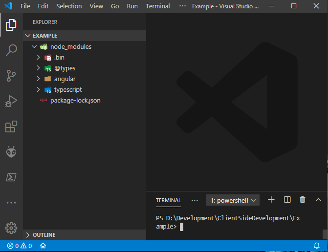
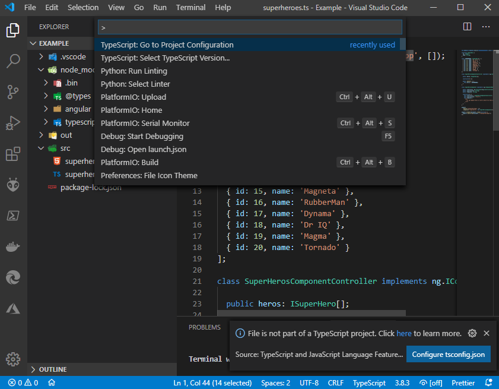
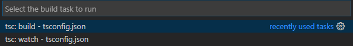

# AngularJS Sample project using Visual Studio Code and TypeScript

See my [blogpost](https://jurjan.info/posts/programming/angularjs/superheroes/) for more information.

### Prerequisites
1) Download and install [Visual Studio Code](https://code.visualstudio.com/)
2) Download and install [NodeJS LTS](https://nodejs.org/en/download/)
3) (recommended) Visual Studio Code extension [Live Server](https://github.com/ritwickdey/vscode-live-server) for local webserver and live reload

### Project installation steps
1) Create a directory for your project, for example 'AngularJS' 
2) Start Visual Studio Code, open the created directory and open a Terminal
   
```
npm install --save-dev typescript
npm install --save-dev angular
npm install --save-dev @types/angular
```



3) Create a 'src' and 'out' folder
4) Create a 'superheroes.ts' and 'superheroes.html' file
5) Copy the html and js into the files created in step above
6) Press Ctrl+Shift+P and execute:



6) Click on the 'Configure tsconfig.json'
7) This will open a newly created 'tsconfig.json', but because we want the output of the compiled typescript to be in the 'out' folder we need to add this "outDir" to the JSON file.

```
{
    "compilerOptions": {
        "module": "commonjs",
        "target": "es2016",
        "jsx": "preserve",
        "sourceMap": true,
        "outDir": "out"
    },
    "exclude": [
        "node_modules",
        "**/node_modules/*"
    ]
}
```

### Launch the app
1) Build the appliction using Ctrl+Shift+B


You have two options here:
1) Build, only compile the typescript files once
2) Watch, continuous (re)build when a TypeScript file has changed

### Debugging

1) To enable debugging to go the debug tab (Ctrl + Shift + D) and click the 'add configuration' in the dropdown. Select 'Chrome Launch' or 'Edge Launch' based on your preference.
4) Change the url to 'http://127.0.0.1:5500/src/superheroes/superheroes.html'

